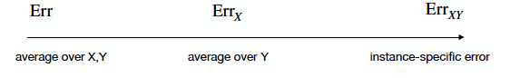

```{r xaringan-scribble, echo=FALSE}
xaringanExtra::use_scribble(pen_color="#1A292C") #activate for the pencil
xaringanExtra::use_panelset() #panel set
```

```{r include = FALSE}
knitr::opts_chunk$set(message = FALSE, warning = FALSE, fig.align = "center")
library(tidyverse)
```

# Motivation
<br>
- In machine learning applications, when deploying a <b><span style="color:#067373;">predictive model</span></b>, the main interest is on understanding <b><span style="color:#067373;">prediction accuracy</span></b> of the model on future test points. 
- The standard measure of accuracy for a predictive model is the <b><span style="color:#067373;">prediction error</span></b>, i.e., the <b><span style="color:#067373;">expected loss on future test points</span></b>.
- For inference, both <b><span style="color:#067373;">good point estimates</span></b> and <b><span style="color:#067373;">accurate confidence intervals</span></b> are required for <b><span style="color:#067373;">prediction error</span></b>.

---
# Motivation continu'ed
<br>
- From a practical point of view, <b><span style="color:#067373;">cross-validation (CV)</span></b> is one of the widely-used resampling-based approaches to estimate a <b><span style="color:#067373;">point estimate</span></b> and to build <b><span style="color:#067373;">confidence intervals</span></b> for prediction error.
- However, <b><span style="color:#067373;">Bates, Hastie, and Tibshirani (2021)</span></b> discuss that (statistical) properties of CV estimator of prediction error are **not well-understood** despite CV has a very simple functionality.

---
# Aim
<br>
- <b><span style="color:#067373;">Bates, Hastie, and Tibshirani (2021)</span></b> firstly show that the <b><span style="color:#067373;">CV estimator of prediction error</span></b>:
  - tracks **the accuracy of the model fit weakly** and, instead
  - estimates **the average prediction error of models fit across many (hypothetical) data sets from the same population**.  

---
# Aim continu'ed
<br> 
- <b><span style="color:#067373;">Bates, Hastie, and Tibshirani (2021)</span></b> secondly show that </span></b> the <b><span style="color:#067373;">naive confidence intervals</span></b> based on CV estimate of prediction error give **poor coverage**, which are far below nominal level since the estimation of variance used to compute the width of the interval does not account for the **correlation between error estimates** in different folds, which arises  because each data point is used for both training and testing.  
- <b><span style="color:#067373;">Bates, Hastie, and Tibshirani (2021)</span></b> propose the <b><span style="color:#067373;">nested cross-validation (NCV)</span></b> approach which delivers confidence intervals with a **coverage close to the nominal level**.  
- <b><span style="color:#067373;">Bates, Hastie, and Tibshirani (2021)</span></b> validate their work with theory and extensive numerical experiments (both simulation studies and real data examples).
 
---
# Setting and notation
<br>
- Consider a <b><span style="color:#067373;">supervised learning </span></b> setting.  
- We have <b><span style="color:#067373;">feature matrix</span></b> $X=(X_1, \ldots, X_n)  \in \mathcal{X}^{n \times p }$
and <b><span style="color:#067373;">response vector </span></b> $Y=(Y_1, \ldots, Y_n)  \in \mathcal{Y}^{n}$.
- We assume that each <b><span style="color:#067373;">data point</span></b> $(X_i,Y_i)$ for $i=1,\ldots,n$
are i.i.d. from a <b><span style="color:#067373;"> distribution</span></b> $P$. 

```{r, eval=F, echo=F}
with each $X_i \in \mathbb{R}^{p}$
```

---
# Setting and notation continu'ed
<br>
- Consider a <b><span style="color:#067373;">class of models </span></b> parameterized by $\theta$.
- We let $\widehat f(x, \theta)$ be the <b><span style="color:#067373;">function that predicts</span></b> $y$ from $x \in \mathbb{R}^{p}$, where $\theta$ takes values in some space $\Theta$.
- We let $\mathcal{A}$ be a <b><span style="color:#067373;">model-fitting algorithm</span></b> that takes data points and returns a parameter vector $\widehat \theta \in \Theta$. 
- We let $\hat \theta =\mathcal{A}(X,Y)$ be the <b><span style="color:#067373;"> fitted value of the parameter </span></b> based on the observed data $X$ and $Y$. 

---
# Prediction error 
<br>
- In <b><span style="color:#067373;">measuring accuracy of a model</span></b>, we are interested in <b><span style="color:#067373;">out-of-sample error</span></b> which is defined as the <b><span style="color:#067373;">expected loss on unseen data points</span></b> :

\begin{equation}
Err_{XY}: = \mathbb{E}\bigg[	\ell \big(\hat{f}(X_{n+1},\hat \theta ),Y_{n+1}\big) \vert (X,Y) \bigg] , \nonumber
\end{equation}

- where $(X_{n+1},Y_{n+1})$ is an <b><span style="color:#067373;">independent test point</span></b> from the same distribution $P$. 
- The expression $\hat{f}(X_{n+1},\hat \theta)$ is the <b><span style="color:#067373;">predicted value</span></b> of $Y_{n+1}$ at the future point $X_{n+1}$ and $\hat \theta$ is the fitted value of the parameter estimated through algorithm $\mathcal{A}$ based on the training data $(X,Y)$.
- The expression $\ell \big(\hat{f}(X_{n+1},\hat \theta ),Y_{n+1}\big)$ is the <b><span style="color:#067373;">loss</span></b> between predicted value of $Y_{n+1}$ and $Y_{n+1}$ itself.
- Here, the <b><span style="color:#067373;">loss function</span></b> $\ell(.)$ could be squared error loss, classification error, or deviance (cross-entropy). 
- Furthermore $Err_{XY}$ can be considered as a <b><span style="color:#067373;">random quantity</span></b>  depending on the training data $(X,Y)$.

---
# Expected prediction error
<br>
- On the other hand, in designing and comparing <b><span style="color:#067373;">learning algorithms</span></b> themselves, we are interested in their <b><span style="color:#067373;">average performance</span></b> on predicting future test points.
- We can formally define this quantity as
the <b><span style="color:#067373;">expected value of prediction error when training over possible data sets of size n drawn from the same data distribution $P$</span></b>:

\begin{equation}
Err :=\mathbb{E}\big[Err_{XY}\big].\nonumber
\end{equation}

- Shortly: it is the expectation of prediction error across possible training sets (from the same distribution).

---

- Note that estimates of the quantities $Err_{XY}$ and $Err$ **cannot be computed** when the **data distribution** $P$ is **unknown**.
- Then, <b><span style="color:#067373;">resampling based methods</span></b> such as cross-validation, bootstrap, and jacknife or <b><span style="color:#067373;">analytical methods</span></b> such as AIC, BIC, Mallow's $C_p$, and covariance penalties can be used to **estimate the quantities** $Err_{XY}$ and $Err$.


---
# K-fold cross-validation
<br>
- In <b><span style="color:#067373;">K-fold cross-validation</span></b>, we randomly partition the data into equally sized <b><span style="color:#067373;">disjoint
folds (subsets)</span></b> $\mathcal{I}_k$ $(k=1,\ldots,K)$, where the fold size is $m=n/K$ and the whole data is $\mathcal{I} = \cup_{k=1}^{K} \mathcal{I}_k$.
- When the data point $(x_i,y_i) \in \mathcal{I}_k$, we will also write $i \in \mathcal{I}_k$ $(k=1,\ldots,K)$.

```{r, echo=F, out.width="13%", fig.cap="<i>Partition of the data into K-folds.</i>"}

```

<div style="text-align:right;"><font size="4px"><a href="https://www.researchgate.net/profile/Mingchao-Li/publication/331209203/figure/fig2/AS:728070977748994@1550597056956/K-fold-cross-validation-method.png">Image Source</a></font></div>

---

- Consider the first fold $\mathcal{I}_{1}$ and hold it out as future data set (or <b><span style="color:#067373;">test set</span></b>).
- The data points $(x_i,y_i) \in \mathcal{I} \backslash \mathcal{I}_{1}$, which are not in the first fold, are called as <b><span style="color:#067373;">training set</span></b>.
- Let $\hat \theta^{(-1)} = \mathcal{A}\big((X_i,Y_i)_{i \in \mathcal{I} \backslash \mathcal{I}_{1}}\big)$  be the **model fit on training data set**, then
we calculate the **prediction error** over fixed $\mathcal{I}_{1}$ set as follows:

\begin{equation}
 \frac{1}{m} \sum_{{i} \in \mathcal{I}_1}\ell \big(\hat{f}(x_{i},\hat \theta^{(-1) } ),y_i\big).
\end{equation}
---
- In <b><span style="color:#067373;">K-fold cross-validation</span></b>, we repeat this process for each fold $(k=1,\ldots,K)$.


```{r, echo=F, out.width="60%", fig.cap="<i>K-fold cross-validation.</i>"}
knitr::include_graphics("imgs/K_CV.png")
```

<div style="text-align:right;"><font size="4px"><a href="https://www.researchgate.net/profile/Mingchao-Li/publication/331209203/figure/fig2/AS:728070977748994@1550597056956/K-fold-cross-validation-method.png">Image Source</a></font></div>

---
# CV estimate of prediction error
<br>
- The **average of errors over K folds** is given as follows:

\begin{equation}
	\widehat {Err} ^{(CV)} := \frac{1} {K} \sum_{k=1}^{K} \frac{1} {m}\sum_{{i} \in \mathcal{I}_k} \ell \big(\hat{f}(x_{i},\hat \theta^{(-1)}),y_i\big).
\end{equation}

- This is usually called as the <b><span style="color:#067373;">CV estimate of prediction error</span></b>.
- **Relationship between $\widehat {Err} ^{(CV)}$, $Err_{XY}$, and $Err$**: Intuitively, the inner sum is an estimate for $Err_{XY}$ for a fixed fold, and the double sum estimates $Err$ with $\mathcal{I}_k$  $( k=1,\ldots,K)$ being different samples from the same distribution <b><span style="color:#067373;">(De Benito Delgado, 2021)</span></b>.

---
# What prediction error are we estimating?

<br>
- $Err_{XY}$ is the <b><span style="color:#067373;">prediction error of the model which was fit on the training set</span></b>.
- $Err$ is the <b><span style="color:#067373;">average of the fitting algorithm run on the same-sized data sets drawn
from the same distribution $P$.</span></b>
- The former quantity is of the most interest to a practitioner deploying a specific model, whereas the latter  may be of interest to a researcher comparing different fitting algorithms.

---
- Some studies such as Zhang (1995), Hastie et al. (2009), and Yousef (2020)
have observed that **cross-validation estimate provides little information** about $Err_{XY}$ which is also called as _weak correlation_ problem in the literature.
- For the special case of the linear model, <b><span style="color:#067373;">Bates, Hastie, and Tibshirani (2021)</span></b> claim that CV should be **considered as an estimate** of $Err$  rather than $Err_{XY}$.


---
# $Err_{X}$:  A different target of inference
<br>
- Assume a <b><span style="color:#067373;">homoskedastic Gaussian linear model</span></b> as follows:

\begin{equation}
y_i = x_{i}^{T} \theta + \epsilon_i \quad \text{where} \quad \epsilon_i \overset{i.i.d.}{\sim} N(0,\sigma^2)  \quad \text{i=1,...,n.}
\end{equation}

- Define a <b><span style="color:#067373;">new key quantity</span></b> as follows:

\begin{equation}
Err_{X} := \mathbb{E}[Err_{XY} | X],
\end{equation}

- which **falls between** $Err$ and $Err_{XY}$ as visualized below:

<br>
```{r, echo=F, out.width="60%", fig.cap="<i>Possible targets of inference for cross-validation.</i>"}

```

---
$$ \newcommand\independent{\protect\mathpalette{\protect\independenT}{\perp}}
\def\independenT#1#2{\mathrel{\rlap{$#1#2$}\mkern2mu{#1#2}}}$$ 

- **Lemma 1:** When ordinary least squares (OLS) is used as the fitting
algorithm along with a squared-error loss function, the CV estimate of prediction error, 
$\widehat {Err}^{(CV)}$, is linearly invariant.

--

- << Under this setting, residuals turns out to be the same for both **original** $(x_{1}, y_{1}),...,(x_{n}, y_{n})$ and **shifted data** $(x_{1}, y_{1}^{'}),...,(x_{n}, y_{n}^{'})$, where $(y_{i}^{'} = y_{i} + x_{i}^{T} \kappa)$. Since the CV estimate of prediction error is the mean of the squared residuals, then the CV estimate of prediction error also turns out to be **the same** for both the **original data** and the **shifted data**. >>

---
- **Theorem 1:** Assume homoskedastic Gaussian linear model holds and that we use
squared-error loss function. Let $\widehat {Err}$ be a **linearly invariant estimate of prediction
error** (such as $\widehat {Err}^{(CV)}$ using OLS as the fitting algorithm). Then,

\begin{equation}
\widehat {Err} \perp Err_{XY} \quad | \quad X.
\end{equation}

--
- << Recall from classical linear regression theory that when using OLS, the **estimated coefficient** vector $\widehat {\theta}$ is independent of the **residuals** $(Y-X\widehat {\theta})$:

\begin{equation}
\widehat {\theta} \perp (Y-X\widehat {\theta}) \quad | \quad X.
\end{equation}

- Since $Err_{XY}$  is a function of $\widehat {\theta}$ only, which is the OLS estimate of $\theta$, and any linearly invariant estimate of prediction error $Err$ is a function only of residuals, $Y-X\widehat {\theta}$, by the invariance property, then $\widehat {Err} \perp Err_{XY} \quad | \quad X$. >>

---
- **Corollary 1:**  Under the conditions of Theorem 1, we get the following decomposition:

\begin{equation}
\mathbb{E}\Big[\big(\widehat Err-Err_{XY}\big)^2\Big] = \mathbb{E}\Big[\big(\widehat Err-Err_{X}\big)^2\Big] + \mathbb{E}\Big[Var\big(Err_{XY}|X\big)\Big].
\end{equation}

--

- << Any linearly invariant estimator (such as cross-validation) has **larger mean squared error** (MSE) as an estimate of $Err_{XY}$ than as an estimate of $Err_{X}$. >>

- This implies that $\widehat Err^{CV}$ is a better estimate of the intermediate quantity $Err_{X}$ than of $Err_{XY}$.

---
# Example
<br>
- Consider an experiment in a simple linear model with $n=100$ observations
and $p=20$ features $\overset{i.i.d.}{\sim} N(0,1)$, which is replicated $n=2000$ times with the same feature matrix $X$.

```{r, echo=F, out.width="60%"}
knitr::include_graphics("imgs/paper_fig3.png")
```

- Left: **MSE of CV point estimate of prediction error** relative to **three estimands**: $Err$, $Err_{X}$, and $Err_{XY}$.
- Right: Coverage of $Err$, $Err_{X}$, and $Err_{XY}$ by the naive cross-validation intervals, where nominal miscoverage rate is $10\%$.
---
- We see that CV point estimate has **lower MSE** for $Err_{X}$ than $Err_{XY}$.
- The naive CV intervals cover $Err_{X}$ **more often** than they cover $Err_{XY}$.

<br>

```{r, echo=F, out.width="60%"}
knitr::include_graphics("imgs/paper_fig3.png")
```

- **Side note:** Each pair of points connected by a line represents the 2000 replicates with the same feature matrix $X$.


---
# Relationship between $Err$ and $Err_{X}$
<br>
- These results suggest that, for CV point estimate of prediction error, $Err_{X}$ is a more **natural target of inference** (estimand) rather than $Err_{XY}$.
- <b><span style="color:#067373;">Bates, Hastie, and Tibshirani (2021)</span></b> further investigate the **relationship** between $Err$ and $Err_{X}$.

<br>
```{r, echo=F, out.width="60%", fig.cap="<i>Possible targets of inference for cross-validation.</i>"}

```

---
# Relationship between $Err$ and $Err_{X}$
<br>
- The variance of $Err_{XY}$ is decomposed with the **conditional variance** formula (conditioned on $X$):

\begin{align}
Var(Err_{XY}) &=\mathbb{E}_{X}\big[Var(Err_{XY}|X)\big] + Var\big(\mathbb{E}_{X}[Err_{XY}|X]\big) \\
              &=\mathbb{E}_{X}\big[Var(Err_{XY}|X)\big] + Var\big(Err_{X}\big),
\end{align}

- $Var\big(Err_{X}\big)$: is the **variance caused by the randomness** in $X$ and
- $\mathbb{E}_{X}\big[Var(Err_{XY}|X)\big]$: is the **variance caused by the randomness** in $Y | X$.

---
- **Theorem 2:** Suppose the homeskedastic Gaussian linear model holds and that we use a squared-error loss. In addition, assume that feature vectors $X \sim N(0,\Sigma_p)$ for any
full-rank $\Sigma_p$ (including identity matrix). Then, for $n > p$, as $n, p  \rightarrow \infty$ with $n/p \rightarrow \lambda >1$, we have:


\begin{align}
\mathbb{E}_{X}\big[Var(Err_{XY}|X)\big] = \Theta(1/n) \quad \text{and} \\
Var\big(Err_{X}\big) = \mathbb{E}(Err_{X}-Err)^2 = \Theta(1/n^2).
\end{align}

- We see that the randomness caused by $Y$ given $X$ is of larger order than that due the randomness in $X$.
---
- The variance of $Err_{X}$ (which also has mean $Err$) is small compared with the variance of $Err_{XY}$ (which also has mean $Err$), showing that $Err_{X}$ is close to $Err$.
- Note that MSE and coverage of cross-validation is similar when estimating either $Err$ or $Err_{X}$, but significantly different when estimating $Err_{XY}$.

```{r, echo=F, out.width="60%"}
knitr::include_graphics("imgs/paper_fig3.png")
```

---
- In the proportional asymptotic limit, implies that $	\widehat {Err} ^{(CV)}$
is closer to $Err$ and $Err_{X}$ than to $Err_{XY}$.

- **Corollary 2:** In the setting of Theorem 2,

\begin{align}
cor(Err_{XY}, Err_{X}) \rightarrow 0, \quad \text{n, p} \rightarrow \infty.
\end{align}

- Moreover, for any linearly invariant estimator $\widehat {Err}$ (such as $	\widehat {Err} ^{(CV)}$ using OLS as the fitting algorithm), 

\begin{align}
cor(Err_{XY}, \widehat{Err}) \rightarrow 0, \quad \text{n, p} \rightarrow \infty.
\end{align}

- This implies that $	\widehat{Err}^{(CV)}$ is asymptotically uncorrelated with $Err_{XY}$.

---
# Dependence structure of CV errors
- Let 
$e_i =\ell \big(\hat{f}(x_{i},\hat \theta^{(-1) } ),y_i\big)$ for each $i \in \mathcal{I}_k$ ( $k=1,\ldots,K$ ), and the errors $e_i$ for points in other folds are defined
similarly.
- Since $n =  K \times m$,  we can **re-define** <b><span style="color:#067373;">CV estimate of prediction error</span></b> as follows:

\begin{equation}
	\widehat {Err } ^{(CV)}:= 	\bar e = \frac{1} {n}  \sum_{i=1}^{n}e_i. \nonumber
\end{equation}

- Remember that
$e_i =\ell \big(\hat{f}(x_{i},\hat \theta^{(-1) } ),y_i\big)$ for each $i \in \mathcal{I}_k$ ( $k=1,\ldots,K$ ), and the errors $e_i$ for points in other folds are defined
similarly.

---
- The cross-validation estimate of the prediction error is:

\begin{equation}
	\widehat {Err } ^{(CV)}:= 	\bar e = \frac{1} {n}  \sum_{i=1}^{n}e_i. \nonumber
\end{equation}

- Assuming that $e_i$'s are i.i.d., an <b><span style="color:#067373;">estimate of the standard error of the prediction error</span></b> would be:

\begin{equation}
	\widehat{se}^{(CV)}:=\frac{1} {\sqrt n} \times \sqrt {\frac{1} {n-1} \sum_{i=1}^{n}(e_i-\bar e)^2},  \nonumber
\end{equation}
- where the second term in the multiplication refers to the  <b><span style="color:#067373;">empirical standard deviation of the $e_i$</span></b>. 

---
# A $100(1-\alpha)\%$ confidence interval for prediction error
<br>
- A $100(1-\alpha)\%$ <b><span style="color:#067373;">confidence interval for prediction error</span></b> can be constructed as follows:

\begin{equation}
\Big(\widehat {Err}^{(CV)} - z_{1-(\frac{\alpha}{2})} \times \widehat{se}^{(CV)} \quad, \quad \widehat {Err}^{(CV)} + z_{1-(\frac{\alpha}{2})} \times \widehat{se}^{(CV)} \Big)
\end{equation}

- where $z_{1- (\frac{\alpha}{2}) }$ is the $1- (\frac{\alpha}{2})$ quantile of the standard normal distribution. 
- The intervals are called as <b><span style="color:#067373;">naive cross-validation intervals</span></b>.

- However, since every data point is used in both in training and testing, we cannot accept that are $e_i$'s are independent of each other. 

- As K approaches to n, correlations between $e_i$'s would increase, and hence would results in higher variance.

- Any confidence interval built using will be too small and have poor coverage.

---
# Example

- Consider a sparse logistic model:

\begin{align}
Pr(Y_i = 1 | X_i = x_i) = \frac{1}{1 + exp(-x_{i}^{T}\theta)}, \quad \text{i=1,...,n},
\end{align}

- where $n=90$ observations of $p=1000$ features, and a coefficient 
$\theta = c \times (1,1,1,1,0,0,...)^{T} \in \mathcal{R}^{p}$ and $c$ is chosen such that misclassification rate is $20 \%$.

- We estimate the parameters using $\ell_1-$ penalized logistic regression with a fixed
penalty level.

---
<br>
- In this case, naive confidence intervals for prediction error are far too small: intervals with desired miscoverage of $10\%$ give $31\%$ miscoverage in our simulation.

```{r, echo=F, out.width="45%", fig.cap="<i>Structure of the covariance matrix of errrors.</i>"}
knitr::include_graphics("imgs/logistic_cv.png")
```

---
```{css echo=FALSE}
.pull-left {
  float: left;
  width: 50%;
}
.pull-right {
  float: right;
  width: 50%;
}
```

.pull-left[
- The fundamental paper of Bengio and Grandvalet (2004) gives the key structure of the covariance matrix of $e_i$'s such that:

\begin{equation}
Var(\widehat {Err}^{(CV)}) = \frac{1}{n}a_1 + \frac{n/K-1}{n}a_2 + \frac{n-n/K}{n}a_3,
\end{equation}

- where $a_1=Var(e_i)$ is the variance of the diagonal elements,
- $a_2 = Cov(e_i, e_j)$ is the covariance of the off-diagonal elements within the same fold (in-block covariance of errors due to a common training set), and
- $a_3 = Cov(e_i, e_j)$  is the covariance between-blocks covariance due the dependence between training sets $\mathcal{I}_k$  $(k=1,\ldots,K)$.


]


.pull-right[
```{r, echo=F, out.width="70%", fig.cap="<i>Structure of the covariance matrix of errrors.</i>"}
knitr::include_graphics("imgs/covariance_structure.png")
```

<div style="text-align:right;"><font size="4px"><a href="https://www.jmlr.org/papers/volume5/grandvalet04a/grandvalet04a.pdf">Image Source</a></font></div>
]

---
- The constants $a_2$ and $a_3$ will typically be positive, in which case 

\begin{equation}
Var(\widehat {Err}^{(CV)}) > \frac{1}{n}a_1,
\end{equation}

- so estimating the variance of $\widehat{Err}^{(CV)}$ as $\widehat{se}^2$ results in an estimate that it is too small, and, in turn, poor coverage.


---
# Target of inference

- **Definition 2:** For a sample of size n split into K folds, the cross-validation MSE is:

\begin{equation}
MSE_{K,n} := \mathbb{E}\big[ (\widehat {Err}^{(CV)} - Err_{XY})^2 \big]
\end{equation}

- Due to technical reasons, MSE is defined with respect to  $Err_{XY}$
- MSE contains both a bias term and variance term, but the bias typically
small for cross-validation [Efron, 1983; Efron and Gong, 1983; Efron and Tibshirani, 1997].
- We can view the MSE as a slightly conservative version of the variance of the cross-validation estimator, i.e., the squared standard error.
- We will use an estimate of the MSE to construct confidence intervals for $Err_{XY}$ since it is what
typically matters for practical applications.
- With this in mind, we will use an estimate of the MSE to construct confidence intervals for $Err_{XY}$. 

---
# Algorithm: Nested cross validaion

- Split D into K folds with K-1 building $D_{train}$ and the remaining
one being $D_{out}$, with indices $I_{out}$.
- For each split j:
  - Compute $\epsilon_j := \bar{e}_{in}=\widehat {Err}_{\tilde X \tilde Y}$ with (K-2)-fold
  CV over K-1 folds in $D_{in}$.
  - Train model on $D_{train}$. Compute $e_{i}$ for all samples $(x_i,y_i) \in D_{out}$.
  - Compute $\bar e_{out} := \text{mean of} \quad \{e_i\}_{e \in I_{out}}$
  - Set $a_j := (\widehat {Err}_{\tilde X \tilde Y} - \bar e_{out})^2$ (estimate of (a)).
  - Set $b_j := \text{empirical variance of} \quad \{e_i\}_{e \in I_{out}}$ (estimate of (b)).
- Output  $\widehat{MSE} = mean(a_j)-mean(b_j)$. 
- Output $\widehat {Err}^{(NCV)} := mean(\epsilon_j)$.
 


---
# Estimation of bias

\begin{equation}
\widehat {Err}^{(NCV)} - \widehat {Err}^{(CV)}
\end{equation}


\begin{equation}
\widehat {bias} := \bigg(1 + \Big(\frac{K-2}{K}\Big)\bigg) (\widehat {Err}^{(NCV)} - \widehat {Err}^{(CV)})
\end{equation}


\begin{equation}
\Big(\widehat {Err}^{(NCV)} - \widehat {bias}- z_{1-(\frac{\alpha}{2})} \sqrt{\frac{K-1}{K}}\sqrt{\widehat {MSE}}, \widehat {Err}^{(NCV)} + \widehat {bias}- z_{1-(\frac{\alpha}{2})} \sqrt{\frac{K-1}{K}}\sqrt{\widehat {MSE}}\Big)
\end{equation}

---
# Future work

- It is well-known that CV is also commonly used for selecting a good value of a learning algorithm's hyperparameters (fine-tuning).
- <b><span style="color:#067373;">Bates, Hastie, and Tibshirani (2021)</span></b> expect that NCV would be of use for hyperparameter selection since it yields more accurate confidence intervals for prediction error.
- A note: The theory developed in Sections 2 and 3 of the paper applies not only to CV but to other methods as well: data-splitting with refitting (train on one half of the data, evaluate on the other,
then refit on the whole data set), Mallow's $C_p$ and bootstrap.
---

class: center, middle


<br> Merci!.. </br>
